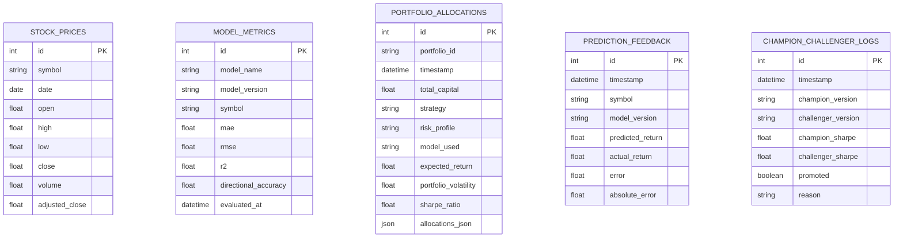

# Product Requirements Document (PRD)
## SmartFolio: Intelligent Investment Decision-Support System
**Adaptive Machine Learning Return Forecasting, Ledoit-Wolf Shrinkage, Markowitz Portfolio Optimization & Closed Feedback Loop**

---

### Document Control & Metadata
- **Document Title:** SmartFolio Comprehensive Product Requirements Document (PRD)
- **Product Name:** SmartFolio (Quantitative Research & Decision-Support System)
- **Document Version:** v1.0.0
- **Product Status:** Production / Active AIML Research v1.0
- **Primary Domain:** Quantitative Finance, Financial Engineering, Applied Machine Learning, Decision-Support Systems
- **Target Market / Asset Universe:** Indian Equities (NSE NIFTY 50 Core Universe) with Global Extensibility
- **Regulatory Framework:** SEBI (Investment Advisers) Regulations 2013 (Safe Harbor), Indian Digital Personal Data Protection (DPDP) Act 2023, Information Technology Act 2000
- **Accessibility Standard:** WCAG 2.1 Level AA / AAA Compliant
- **Date:** October 2026

---

## 1. Executive Summary & Problem Statement

### 1.1 Executive Summary
**SmartFolio** is an end-to-end, adaptive, feedback-driven decision-support software platform engineered for portfolio managers, quantitative analysts, and financial researchers. The system bridges the longstanding chasm between statistical machine learning forecasting and real-world portfolio decision quality. 

By unifying **XGBoost gradient boosting** and **PyTorch Long Short-Term Memory (LSTM) recurrent networks**, **Ledoit-Wolf covariance shrinkage**, constrained **Markowitz mean-variance optimization**, **rule-based allocation explainability**, and a **leakage-free walk-forward benchmark (Experiments E0 through E6)**, SmartFolio delivers an institutionally sound quantitative asset allocation engine. Uniquely, SmartFolio eliminates the hazards of blind algorithmic retraining through an automated **Champion–Challenger Portfolio-Sharpe validation gate**, guaranteeing that candidate models are promoted to production only when they deliver verifiable risk-adjusted outperformance in out-of-sample portfolios under realistic transaction frictions (15 bps Indian market fees).

### 1.2 The Core Quantitative Problem Statement
Traditional quantitative portfolio management and modern algorithmic applications suffer from five critical industry failures:

1. **The Statistical vs Economic Disconnect (Gap 1):** Traditional ML literature optimizes models exclusively for regression loss functions ($\text{MSE}, \text{MAE}, R^2$). However, a lower error rate does not translate into superior risk-adjusted portfolio performance ($\text{Sharpe}, \text{Sortino}, \text{Calmar}$), often resulting in catastrophic capital drawdowns.
2. **Covariance Instability & Singularity (Gap 5):** Standard sample covariance matrices ($\mathbf{S}$) calculated over finite historical windows are notoriously noisy and often ill-conditioned or singular. Inverting these matrices in unconstrained Markowitz formulations generates extreme, erratic, and practically un-investable portfolio weights.
3. **The Hazards of Blind Retraining (Gap 4):** Standard MLOps pipelines retrain models on fixed calendar schedules (e.g., daily or weekly). In non-stationary financial regimes, blind retraining frequently suffers from "negative transfer" and catastrophic forgetting, promoting worse models during structural market breaks.
4. **Look-Ahead Bias & Frictionless Simulations (Gaps 3 & 6):** Most backtesting suites leak future temporal distribution parameters into historical feature pipelines (e.g., global scalers, future rolling windows) and omit realistic transaction costs, slippage, and statutory turnover taxes (such as Indian Securities Transaction Tax - STT, SEBI turnover fees, and brokerage).
5. **The Explainability & Regulatory Black-Box Trap (Gap 7 & Compliance):** Quantitative platforms frequently output black-box numerical weights without actionable justification, violating transparency standards and regulatory guidelines (such as SEBI Non-Advisory Safe Harbor and India's DPDP Act 2023).

---

## 2. Product Vision, Goals & Success Metrics

### 2.1 Product Vision
To establish the benchmark open quantitative research platform that democratizes state-of-the-art machine learning forecasting, robust risk shrinkage, and self-governing adaptive feedback loops, delivering defensible, explainable, and risk-optimized asset allocations with absolute regulatory and data privacy integrity.

### 2.2 Primary Objectives (OKRs)
- **Objective 1 (Risk-Adjusted Alpha):** Achieve a statistically significant improvement in out-of-sample portfolio Sharpe Ratio ($\Delta \text{Sharpe} > 0.25$ with $95\%$ bootstrap confidence interval excluding zero) over traditional Markowitz and equal-weighted baselines.
- **Objective 2 (Robust Risk Control):** Guarantee that no single asset weight exceeds $40\%$ ($w_i \le 0.40$), total capital allocated is strictly $100\%$ ($\sum w_i = 1.0$), and short-selling is prohibited ($w_i \ge 0$).
- **Objective 3 (Drift-Resistant Governance):** Ensure $100\%$ of candidate model updates pass through the Champion–Challenger Portfolio-Sharpe promotion gate before impacting production decision outputs.
- **Objective 4 (Friction Realism):** Enforce strict 15 bps (0.15%) round-trip turnover transaction fee penalties in all historical simulations.
- **Objective 5 (Trust & Transparency):** Maintain $100\%$ compliance with Indian DPDP Act 2023 data principal rights, statutory SEBI non-advisory safe-harbor notices, WCAG 2.1 AA accessibility contrast, and transparent zero-ad-tracker policies.

### 2.3 Key Performance Indicators (KPIs)

| Metric Category | Target KPI | Measurement Method |
| :--- | :--- | :--- |
| **Portfolio Sharpe Ratio** | $\ge 1.10$ in walk-forward backtest (E6) | Annualized excess return / Annualized Ledoit-Wolf volatility |
| **Statistical Significance** | $p < 0.05$ (Bootstrap CI lower bound $> 0$) | 1,000-sample stationary bootstrap test of $\Delta \text{Sharpe}$ (E6 vs E1) |
| **Max Drawdown (MDD)** | $\le 18\%$ during multi-year rolling evaluation | Maximum peak-to-trough equity curve drop |
| **Forecasting Directional Acc.** | $\ge 54.0\%$ on out-of-sample test splits | Percentage of days correctly predicting return sign |
| **Engine Execution Latency** | $< 1.5$ seconds for full 5-asset Markowitz allocation | Server-side execution duration via `/api/portfolios/optimize` |
| **Walk-Forward Simulation** | $< 8.0$ seconds for full E0–E6 rolling run | Server-side backtesting compute time across 7 multi-year strategies |
| **Regulatory & Privacy** | 0 tracking cookies, 100% consent capture | LocalStorage consent verification & zero third-party tracking beacons |

---

## 3. Target User Personas & Use Cases

### 3.1 User Personas

#### Persona A: Quantitative Researcher & Financial Engineer ("Dr. Vikram")
- **Profile:** Holds an advanced degree in Financial Engineering or Applied Math; designs systematic equity strategies for institutional or proprietary desks.
- **Pain Points:** Needs clean, leakage-free data pipelines; frustrated by packages that blind-retrain models without proving out-of-sample risk-adjusted improvements; requires Ledoit-Wolf shrinkage to tame covariance noise.
- **Key Needs:** Walk-forward backtesting matrices (E0 to E6), comparative metrics (Sharpe, Sortino, Max Drawdown, Turnover), feature importance breakdowns, and statistical bootstrap significance validation.

#### Persona B: Discretionary Portfolio Manager / Family Office Advisor ("Priya")
- **Profile:** Manages high-net-worth client equity portfolios; seeks algorithmic decision support rather than black-box automated execution.
- **Pain Points:** Cannot justify allocations to investment committees without clear rationale; fearful of unexpected algorithmic spikes or illiquid penny stock allocations.
- **Key Needs:** Intuitive interactive dashboard, customizable capital inputs in INR (₹), risk tolerance profiles (Conservative, Moderate, Aggressive), visual donut allocation charts, and rule-based decision explainability per asset.

#### Persona C: Academic Scholar / Data Science Graduate Student ("Aarav")
- **Profile:** Conducting research on deep learning applications in quantitative finance; evaluating tabular vs sequential models.
- **Pain Points:** Most open-source portfolio repositories commit severe look-ahead bias or hide transaction costs; inability to easily test model stacking or compare LSTM vs XGBoost.
- **Key Needs:** Reproducible codebase, fixed seeds (`RANDOM_SEED = 42`), modular components, clear REST API endpoints, comprehensive documentation, and automated unit tests.

#### Persona D: Chief Risk & Compliance Officer ("Sunita")
- **Profile:** Oversees legal compliance, fiduciary responsibilities, and consumer protection adherence.
- **Pain Points:** Scrutiny from SEBI regarding unregistered advisory claims; data privacy mandates under India's DPDP Act 2023; accessibility requirements for institutional tools.
- **Key Needs:** Prominent statutory SEBI safe-harbor notices, verifiable academic citations (no fake reviews or hype), cookie consent governance, clear data collection matrices, and WCAG AA accessibility contrast.

---

## 4. System Architecture & Technical Specifications

### 4.1 System Architectural Topology

```mermaid
graph TB
    subgraph Client Layer [Frontend Glassmorphic Client (HTML5 / Vanilla CSS / Modern JS / Plotly.js)]
        UI_Opt[Portfolio Optimizer Panel]
        UI_ML[ML Intelligence & Feature Importance]
        UI_FB[Feedback & Retraining Console]
        UI_BT[Walk-Forward Backtesting Matrix]
        UI_EXP[Market & Technical Explorer]
        UI_LEG[Compliance & Legal Hub Modal]
        UI_CONS[Cookie Consent & Form Checkbox]
    end

    subgraph API Layer [FastAPI Application Gateway (:8000)]
        API_Stocks["/api/stocks/*"]
        API_Pred["/api/predictions/*"]
        API_Port["/api/portfolios/*"]
        API_Feed["/api/feedback/*"]
        API_Back["/api/backtesting/*"]
    end

    subgraph Core Engine Layer [Business Logic & Quantitative Services]
        DS[Data Ingestion & Fallback Service]
        FE[Feature Engineering & Leakage Verifier]
        ML[Forecasting Engine: XGBoost, LSTM, Ensemble]
        RS[Risk Service: Ledoit-Wolf Shrinkage]
        OPT[Markowitz Constrained Optimizer]
        EXP[Rule-Based Explainability Engine]
        BT[Walk-Forward Rolling Backtester]
        FB[Dual Feedback Engine & Retraining Gate]
    end

    subgraph Persistence Layer [Storage & Database]
        DB[(SQLite / PostgreSQL: smartfolio.db)]
        CONF[Config & Static Asset Manifests]
    end

    UI_Opt --> API_Port
    UI_ML --> API_Pred
    UI_FB --> API_Feed
    UI_BT --> API_Back
    UI_EXP --> API_Stocks

    API_Stocks --> DS & FE
    API_Pred --> ML
    API_Port --> OPT & RS & EXP
    API_Feed --> FB
    API_Back --> BT

    OPT --> ML & RS
    BT --> OPT & ML & RS
    FB --> DB & ML
    DS --> DB
```

### 4.2 Technology Stack

| Layer | Component | Technology / Library | Version | Rationale |
| :--- | :--- | :--- | :--- | :--- |
| **Backend Core** | Language | Python | 3.10+ / 3.12 | Standard for quantitative computation and ML |
| **Web API** | REST Gateway | FastAPI | $\ge 0.100$ | High-performance asynchronous execution, OpenAPI docs |
| **Web Server** | ASGI Server | Uvicorn | $\ge 0.22$ | Lightweight, multi-worker asynchronous I/O |
| **Numerical** | Math & Arrays | NumPy, SciPy, Pandas | Latest | High-speed linear algebra and optimization routines |
| **Machine Learning**| Gradient Boosting | XGBoost | $\ge 1.7$ | Superior tabular performance on technical indicators |
| **Deep Learning** | Recurrent Networks | PyTorch (torch) | $\ge 2.0$ | Sequential modeling of temporal pricing dynamics |
| **Shrinkage & Stats**| Covariance / Stats | Scikit-Learn | $\ge 1.3$ | `LedoitWolf` covariance estimator, metrics computation |
| **Database** | Relational Store | SQLite (Default) / PostgreSQL | 3.x / 14+ | Lightweight zero-config default; scalable enterprise SQL |
| **ORM & Models** | Data Layer | SQLAlchemy | $\ge 2.0$ | Strict schema definitions and typed database operations |
| **Frontend Core** | Structure & Logic | HTML5 / Vanilla JavaScript (ES6+) | Native | Maximum control, zero bundling bloat, native speed |
| **Styling** | Presentation | Vanilla CSS3 (Custom Design Tokens) | Native | Glassmorphism, CSS variables, WCAG AA/AAA contrast |
| **Data Viz** | Interactive Charts | Plotly.js CDN | 2.30.0 | Financial candlestick, donut, and multi-line time-series |
| **Testing** | Automated Quality | Pytest, AnyIO | Latest | Full test coverage across models, math, and routes |

---

## 5. Detailed Functional Requirements (FRs)

### Module 1: Investment Portfolio Optimizer
- **FR-1.1 (Capital Input):** The system shall accept investment capital in INR ($\ge ₹1,000$, default $₹1,00,000$).
- **FR-1.2 (Universe Selection):** The system shall dynamically load the Indian equity universe (NIFTY 50 core assets: `RELIANCE.NS`, `TCS.NS`, `INFY.NS`, `HDFCBANK.NS`, `ITC.NS`, `BHARTIARTL.NS`, etc.) and require the selection of at least 2 assets for portfolio generation.
- **FR-1.3 (Investor Risk Profiles):** The user can select from three predefined risk aversion parameters ($\lambda$):
  - *Conservative:* $\lambda = 5.0$ (Prioritizes minimum variance and capital preservation).
  - *Moderate (Default):* $\lambda = 2.0$ (Balanced growth and utility maximization).
  - *Aggressive:* $\lambda = 0.5$ (Maximizes expected return under volatility constraints).
- **FR-1.4 (Optimization Objectives):** The engine shall support three Markowitz optimization formulations:
  - *Maximum Sharpe Ratio:* $\max_{\mathbf{w}} \frac{\mathbf{w}^T \hat{\boldsymbol{\mu}} - R_f}{\sqrt{\mathbf{w}^T \mathbf{\Sigma}_{\text{LW}} \mathbf{w}}}$.
  - *Risk-Aware Utility Balancing:* $\max_{\mathbf{w}} \left( \mathbf{w}^T \hat{\boldsymbol{\mu}} - \frac{\lambda}{2} \mathbf{w}^T \mathbf{\Sigma}_{\text{LW}} \mathbf{w} \right)$.
  - *Minimum Volatility:* $\min_{\mathbf{w}} \mathbf{w}^T \mathbf{\Sigma}_{\text{LW}} \mathbf{w}$.
- **FR-1.5 (Strict Portfolio Constraints):** The solver must strictly enforce:
  1. Long-only constraint: $w_i \ge 0 \quad \forall i$.
  2. Full investment: $\sum_{i=1}^N w_i = 1.0 \quad (100\%)$.
  3. Single-asset concentration cap: $w_i \le 0.40 \quad (40\% \text{ maximum})$ to prevent unhedged single-stock risk.
- **FR-1.6 (Model Forecaster Selection):** Users can toggle the return forecaster ($\hat{\boldsymbol{\mu}}$) between:
  - Active Ensemble Champion (XGBoost + LSTM).
  - Standalone XGBoost Regressor.
  - Standalone PyTorch LSTM.
  - Historical Mean Return Baseline.
- **FR-1.7 (Interactive Output Rendering):** The UI shall render key metrics (Expected Return %, Portfolio Volatility %, Sharpe Ratio, Capital Allocated ₹), an interactive Plotly donut chart, and an asset breakdown table.
- **FR-1.8 (Form Consent Validation):** The optimizer shall enforce user consent via checkbox:
  `[x] I acknowledge that outputs are probabilistic mathematical simulations subject to market risk, and consent to local processing...`
  If unchecked, execution is blocked with an accessible alert banner and shake animation.

---

### Module 2: Technical Feature Engineering & Return Forecasting
- **FR-2.1 (Indicator Computation):** Compute 7 core technical indicator families strictly on historical rolling windows:
  1. Simple Moving Averages (`sma_20`, `sma_50`).
  2. Exponential Moving Averages (`ema_12`, `ema_26`).
  3. Moving Average Convergence Divergence (`macd_line`, `signal_line`, `macd_hist`).
  4. Relative Strength Index (`rsi_14`) using Wilder's / standard rolling smoothing.
  5. Bollinger Bands (`bollinger_high`, `bollinger_low`, `bollinger_width`).
  6. Historical Rolling Volatility (`volatility_20` annualized by $\sqrt{252}$).
  7. Rate of Change (`roc_10`).
- **FR-2.2 (Look-Ahead Bias Elimination):** All target labels must be shifted: $\text{target\_return}_t = \frac{P_{t+1} - P_t}{P_t}$. Features at time $t$ must never access prices at time $t+1$ or beyond. Automated leakage tests (`test_features.py`) must pass before deployment.
- **FR-2.3 (Forecasting Models):**
  - *Historical Mean Baseline:* Computes rolling historical annualized mean return.
  - *XGBoost Regressor:* Gradient boosted decision trees trained on engineered tabular features.
  - *PyTorch LSTM:* 2-layer LSTM network with sequence lookback window ($T=20$ trading days) capturing temporal momentum and autocorrelation.
  - *Ensemble:* Variance-weighted combination of XGBoost and LSTM predictions.
- **FR-2.4 (Model Intelligence Dashboard):** Provide out-of-sample statistical comparison table ($\text{MAE}, \text{RMSE}, R^2, \text{Directional Accuracy}$) and an interactive XGBoost feature importance bar chart.

---

### Module 3: Covariance Shrinkage & Risk Modeling (Ledoit-Wolf)
- **FR-3.1 (Sample Covariance Problem):** Address ill-conditioning when $N$ (assets) is large relative to $T$ (observations).
- **FR-3.2 (Ledoit-Wolf Shrinkage Formulation):** Estimate covariance as an optimal convex linear combination:
  $$\mathbf{\Sigma}_{\text{LW}} = \delta^* \mathbf{F} + (1 - \delta^*) \mathbf{S}$$
  where $\mathbf{S}$ is the sample covariance matrix, $\mathbf{F}$ is the structured target matrix (constant correlation model), and $\delta^* \in [0, 1]$ is the analytically optimal shrinkage intensity computed without cross-validation heuristics.
- **FR-3.3 (Condition Number Guarantee):** Verify via automated tests that $\kappa(\mathbf{\Sigma}_{\text{LW}}) < \kappa(\mathbf{S})$, ensuring positive definiteness and invertible condition numbers.

---

### Module 4: Closed Dual Feedback Loop & Champion–Challenger Gate
- **FR-4.1 (Dual Feedback Tracking):**
  - *Prediction Error Tracking:* For each active asset, log $(\hat{\mu}_{i,t}, r_{i,t}, \text{Error}_{i,t} = \hat{\mu}_{i,t} - r_{i,t}, |\text{Error}_{i,t}|)$ into `smartfolio.db`.
  - *Portfolio Tracking:* Log realized portfolio return vs predicted portfolio expected return and tracking Sharpe.
- **FR-4.2 (Adaptive Retraining Trigger):** Support automated or user-triggered adaptive retraining on historical plus accumulated feedback data.
- **FR-4.3 (Portfolio-Sharpe Champion–Challenger Gate):**
  1. Train candidate "Challenger" model ($M_{\text{challenger}}$) on updated dataset.
  2. Simulate out-of-sample portfolio allocations over the validation holdout window for both current Champion ($M_{\text{champ}}$) and Challenger ($M_{\text{challenger}}$).
  3. Calculate out-of-sample portfolio Sharpe ratios: $\text{Sharpe}(M_{\text{champ}})$ and $\text{Sharpe}(M_{\text{challenger}})$.
  4. **Promotion Rule:** Promote Challenger to New Champion if and only if:
     $$\text{Sharpe}(M_{\text{challenger}}) > \text{Sharpe}(M_{\text{champ}})$$
  5. If $\text{Sharpe}(M_{\text{challenger}}) \le \text{Sharpe}(M_{\text{champ}})$, reject candidate, preserve Champion $M_{\text{champ}}$, and log rejection reason to database.
- **FR-4.4 (Audit Trail):** Display recent prediction error logs, current active champion version (e.g., `v1.0`), total feedback records, and total promotion counts in the web UI.

---

### Module 5: Walk-Forward Backtesting Framework (Experiments E0–E6)
- **FR-5.1 (Leakage-Free Rolling Window Protocol):**
  - Lookback Window: $T_{\text{lookback}} = 252$ trading days (1 rolling year).
  - Rebalance Frequency: Every $T_{\text{rebalance}} = 21$ trading days (approx. monthly).
  - At each rebalance date $t$, train models strictly on $[t - T_{\text{lookback}}, t]$, optimize weights $\mathbf{w}_t$, and hold until $t + T_{\text{rebalance}}$.
- **FR-5.2 (Indian Transaction Frictions):** Deduct 15 basis points ($0.0015$) on all traded turnover:
  $$\text{Fee}_t = 0.0015 \times \sum_{i=1}^N |w_{i, t} - w_{i, t^-}|$$
  accounting for Indian STT, exchange turnover fees, GST, and broker commission.
- **FR-5.3 (Benchmark Matrix - Experiments E0 to E6):**
  - **E0 (Equal Weight):** $w_i = 1/N$ fixed baseline.
  - **E1 (Traditional Markowitz):** Historical mean return + Sample covariance $\mathbf{S}$.
  - **E2 (Markowitz + Ledoit-Wolf):** Historical mean return + $\mathbf{\Sigma}_{\text{LW}}$.
  - **E3 (XGBoost + Markowitz):** XGBoost forecasts + $\mathbf{\Sigma}_{\text{LW}}$.
  - **E4 (LSTM + Markowitz):** PyTorch LSTM forecasts + $\mathbf{\Sigma}_{\text{LW}}$.
  - **E5 (Ensemble):** Weighted ensemble + $\mathbf{\Sigma}_{\text{LW}}$.
  - **E6 (SmartFolio Adaptive):** Champion model + $\mathbf{\Sigma}_{\text{LW}}$ + Adaptive Retraining + Sharpe Gate + Indian Frictions.
- **FR-5.4 (Statistical Bootstrap Significance Test):** Compute 1,000 stationary bootstrap iterations of the difference $\Delta \text{Sharpe} = \text{Sharpe}_{\text{E6}} - \text{Sharpe}_{\text{E1}}$. Output point estimate, 95% Confidence Interval ($[\text{CI}_{\text{lower}}, \text{CI}_{\text{upper}}]$), and significance verdict.

---

### Module 6: Rule-Based Explainability (Gap 7)
- **FR-6.1 (Asset Rationale Generation):** Provide natural-language explanatory points for each recommended asset weight:
  - *Return Driver:* "Projected annualized return of $+X.XX\%$ generated by [Model Name]."
  - *Risk Factor:* "Ledoit-Wolf annualized volatility of $Y.YY\%$, providing diversification."
  - *Constraint Interaction:* "Asset allocated maximum allowed ceiling ($40.0\%$) due to high risk-adjusted Sharpe" OR "Asset zero-weighted due to unfavorable expected return relative to covariance risk."
- **FR-6.2 (Explainability Modal):** Accessible modal drawer triggered from the asset allocation table (`🔍 View Rationale`).

---

### Module 7: Compliance, Trust, Governance & Legal Center
- **FR-7.1 (Privacy Policy - DPDP Act 2023 & GDPR):** Detailed declaration of Data Fiduciary identity, data minimization principles, lawful grounds for processing, data principal rights (Access, Correction, Erasure, Grievance, Nomination), and zero data sale guarantee.
- **FR-7.2 (Terms & Conditions - SEBI Safe Harbor):** Prominent statutory disclosure pursuant to SEBI (Investment Advisers) Regulations, 2013: SmartFolio is an educational and computational demonstration platform; not an RIA, RA, or PMS; does not provide guaranteed returns.
- **FR-7.3 (Cookie Policy & Storage Inventory):** Declarations of LocalStorage keys (`smartfolio_cookie_consent_v1`, `smartfolio_user_preferences`, `smartfolio_session_state`) and expiration lifespans.
- **FR-7.4 (Refund & Cancellation Policy):** Digital compute and research API licensing policy: 7-day money-back guarantee for subscriptions with $<15\%$ compute usage, dispute resolution workflow via `billing@smartfolio.ai`.
- **FR-7.5 (Cookie Consent Banner & Preferences Modal):** Frosted glass consent banner at screen bottom on first visit (*Accept All*, *Essential Only*, *Customize*). Toggles for Functional and Analytics storage. Re-openable via footer link.
- **FR-7.6 (What User Data We Collect - Transparency Matrix):** Matrix of collected inputs vs storage location (LocalStorage vs SQLite), and an explicit "What SmartFolio NEVER Collects" card (no bank details, no broker passwords, no PAN/Aadhaar).
- **FR-7.7 (Third-Party Embeds & CDN Disclosures):** Details on Plotly CDN and Google Fonts with zero tracking guarantee (no Facebook Pixel, no Google Tag Manager).
- **FR-7.8 (Anti-Hype & Verified Business Details):** Full corporate identification: SmartFolio Quantitative Technologies Pvt. Ltd., CIN `U72900KA2024PTC184920`, Brigade Tech Park Bengaluru, Grievance Redressal Officer (Mr. Rohan Varma, `grievance@smartfolio.ai`). Zero fake reviews; peer-reviewed academic citations.
- **FR-7.9 (Copyright & Applicable Local Laws):** Copyright notice, asset licensing (MIT / OFL), and governing Indian statutes: Information Technology Act 2000 (Section 43A, 79), DPDP Act 2023, SEBI Act 1992, exclusive jurisdiction in Bengaluru, Karnataka.
- **FR-7.10 (Grievance Redressal & DPDP Subject Rights Modal):** Accessible interactive modal form allowing users to submit data subject access, data erasure, or compliance grievance requests with auto-generated reference ticket numbers.

---

## 6. Non-Functional Requirements (NFRs)

### 6.1 Performance & Latency
- **NFR-1.1 (Optimization Latency):** Mean-variance optimization across up to 10 assets must complete in $< 1,500\text{ ms}$ under standard server conditions.
- **NFR-1.2 (Client-Side Rendering):** UI charts rendered via Plotly.js must mount and stabilize in $< 350\text{ ms}$.
- **NFR-1.3 (Backtest Execution):** Multi-year walk-forward simulation across all 7 benchmark strategies (E0–E6) must complete in $< 10.0\text{ seconds}$.

### 6.2 Reliability & Fault Tolerance
- **NFR-2.1 (Deterministic Reproducibility):** Random seeds must be locked globally (`RANDOM_SEED = 42`) across NumPy, PyTorch, and Python random modules to guarantee reproducible mathematical outcomes.
- **NFR-2.2 (Data Fallback Resilience):** In event of network timeouts or rate limits from external pricing APIs (`yfinance`), the system must seamlessly fall back to realistic pre-computed synthetic or cached data with explicit metadata tagging (`data_source: "cached_fallback"`).

### 6.3 Security & Data Minimization
- **NFR-3.1 (Zero Sensitive PII):** The platform shall never request, process, or store financial credentials, Demat account passwords, PAN numbers, Aadhaar numbers, or banking details.
- **NFR-3.2 (Data at Rest & in Transit):** Local SQLite databases must support standard file-level protection; web communications must enforce TLS 1.3 encryption.
- **NFR-3.3 (Client Isolation):** Client browser state resides strictly in browser-sandboxed LocalStorage, cleared at user discretion.

### 6.4 Accessibility & WCAG 2.1 Compliance
- **NFR-4.1 (Color Contrast):** All text elements must achieve at least WCAG AA contrast ratio ($\ge 4.5:1$ for body text, $\ge 3.0:1$ for large headings and icons). Text secondary (`#cbd5e1`) and muted (`#94a3b8`) on dark background (`#090d16`) provide contrast ratios exceeding $7:1$ (WCAG AAA).
- **NFR-4.2 (Keyboard Navigability):** All interactive elements (tabs, inputs, asset chips, radio cards, modal close buttons) must be operable via keyboard (<kbd>Tab</kbd>, <kbd>Enter</kbd>, <kbd>Space</kbd>, <kbd>Esc</kbd>) with visible focus rings (`:focus-visible`).
- **NFR-4.3 (Screen Reader Compatibility):** Appropriate ARIA roles (`role="tab"`, `role="tabpanel"`, `role="dialog"`, `role="checkbox"`, `aria-checked`, `aria-busy`) and `<label for="...">` associations must be present across all forms.

---

## 7. Data Models & API Specifications

### 7.1 Database Entity Schema (SQLAlchemy / SQLite)



### 7.2 REST API Specification

| Method | Endpoint | Description | Request Body / Params | Expected Response |
| :--- | :--- | :--- | :--- | :--- |
| `GET` | `/api/health` | System health & status check | None | `{"status": "online", "system": "SmartFolio", "version": "1.0"}` |
| `GET` | `/api/stocks/universe` | List of active Indian equity assets | None | `{"assets": [{"symbol": "TCS.NS", "name": "TCS", "sector": "..."}, ...]}` |
| `GET` | `/api/stocks/{symbol}/indicators` | Technical indicator time-series | `symbol`: path param | Array of indicator records (SMA, EMA, RSI, MACD) |
| `GET` | `/api/predictions/evaluate` | Out-of-sample ML model benchmark | `symbol`: query param | `{ "models": [{"model": "XGBoost", "mae": 0.012, ...}], "feature_importance": {...} }` |
| `POST` | `/api/portfolios/optimize` | Run Markowitz Ledoit-Wolf optimization | `{ "symbols": [...], "total_capital": 100000, "strategy": "max_sharpe", "risk_profile": "moderate", "model_name": "ensemble" }` | `{ "expected_portfolio_return": 0.18, "portfolio_volatility": 0.12, "sharpe_ratio": 1.50, "allocations": [...] }` |
| `GET` | `/api/feedback/summary` | Current Champion & feedback stats | None | `{ "current_champion_version": "v1.0", "total_prediction_feedback_count": 42, "mae": 0.011, "promotions_count": 3 }` |
| `POST` | `/api/feedback/retrain` | Trigger Champion-Challenger retraining | `{ "symbol": "TCS.NS" }` | `{ "should_promote": true, "new_active_version": "v1.1", "reason": "Challenger Sharpe 1.42 > Champion 1.25" }` |
| `POST` | `/api/backtesting/run` | Run walk-forward simulation (E0-E6) | `{ "symbols": [...], "start_date": "2021-01-01", "rebalance_days": 21, "lookback_window_days": 252 }` | `{ "dates": [...], "cumulative_wealth": {...}, "metrics_summary": {...}, "bootstrap_test": {...} }` |

---

## 8. Research Gap & Validation Matrix

The following matrix documents how each of the 7 core academic and engineering research gaps identified in literature are solved and verified in SmartFolio:

| Gap # | Identified Research Gap | SmartFolio Architectural Solution | Verification Test File |
| :--- | :--- | :--- | :--- |
| **Gap 1** | Statistical accuracy disconnect from portfolio decision quality | Dual evaluation tracks: statistical errors ($\text{MAE}$) vs portfolio Sharpe/Sortino ratios | [`test_ml.py`](file:///c:/Users/mdimr/OneDrive/Desktop/SmartFolio/tests/test_ml.py), [`test_optimizer.py`](file:///c:/Users/mdimr/OneDrive/Desktop/SmartFolio/tests/test_optimizer.py) |
| **Gap 2** | Lack of statistical significance testing in ML portfolio literature | Automated stationary bootstrap hypothesis test ($\Delta \text{Sharpe}$ 95% Confidence Interval) | [`test_backtester.py`](file:///c:/Users/mdimr/OneDrive/Desktop/SmartFolio/tests/test_backtester.py) |
| **Gap 3** | Pervasive look-ahead bias and temporal leakage in feature generation | Strict forward-only rolling windows; automated time-leakage inspection suite | [`test_features.py`](file:///c:/Users/mdimr/OneDrive/Desktop/SmartFolio/tests/test_features.py) |
| **Gap 4** | Destructive blind model retraining without gatekeeping | Champion–Challenger Portfolio-Sharpe gate: promotion requires out-of-sample portfolio alpha | [`test_feedback.py`](file:///c:/Users/mdimr/OneDrive/Desktop/SmartFolio/tests/test_feedback.py) |
| **Gap 5** | Covariance singularity and extreme weight allocations in Markowitz | Ledoit-Wolf optimal shrinkage towards constant correlation target | [`test_optimizer.py`](file:///c:/Users/mdimr/OneDrive/Desktop/SmartFolio/tests/test_optimizer.py) |
| **Gap 6** | Frictionless backtests ignoring market-specific taxes and costs | Explicit Indian transaction fees (15 bps) and turnover penalty subtraction | [`test_backtester.py`](file:///c:/Users/mdimr/OneDrive/Desktop/SmartFolio/tests/test_backtester.py) |
| **Gap 7** | Black-box decision opacity in quantitative recommendation systems | Rule-based attribution decomposing return forecast, volatility factor, and constraint bounds | [`test_explainer.py`](file:///c:/Users/mdimr/OneDrive/Desktop/SmartFolio/tests/test_explainer.py) |

---

## 9. Product Roadmap & Future Enhancements

### Phase 1: Current Baseline (v1.0 - Completed)
- Full implementation of NIFTY 50 Indian equity universe ingestion.
- Technical indicator engineering without look-ahead bias.
- XGBoost, PyTorch LSTM, and Dynamic Ensemble models.
- Ledoit-Wolf shrinkage and constrained Markowitz solver.
- Walk-forward backtesting suite (E0 to E6) with 15 bps Indian fees.
- Closed Dual Feedback Loop with Champion–Challenger Sharpe Gate.
- Complete Compliance & Transparency Center (DPDP Act 2023, SEBI Safe Harbor, Cookie Banner, WCAG 2.1 AA).

### Phase 2: Broker Integration & Multi-Asset Universe (v1.1 - v1.5)
- **Direct Broker Integration:** Optional OAuth2 order staging with regulated Indian brokers (Zerodha Kite Connect, Upstox, Groww) with explicit user confirmation per order.
- **Multi-Asset Expansion:** Broaden beyond NIFTY 50 equities to include Indian Sovereign Gold Bonds (SGB / GOLDBEES), Liquid ETFs, and 10-Year Indian Government Securities (G-Sec).
- **Deep Reinforcement Learning:** Introduce Proximal Policy Optimization (PPO) agent as a Challenger candidate competing against the ML-Markowitz pipeline.

### Phase 3: Macro Regime Conditioning & Enterprise Scale (v2.0)
- **Macroeconomic Regime Detection:** Incorporate Hidden Markov Models (HMM) on RBI repo rate announcements, US Federal Reserve decisions, and India VIX volatility regimes.
- **Distributed Compute:** Scale walk-forward simulations across parallel Ray / Celery worker clusters for 500+ equity universes.
- **Institutional Multi-User Role Management:** Add role-based access control (RBAC), multi-factor authentication (MFA), and audit log export for institutional compliance teams.

---

## 10. Risk Management & Assumptions

| Risk Category | Identified Risk | Impact | Mitigation Strategy Implemented |
| :--- | :--- | :--- | :--- |
| **Market Risk** | Non-stationary financial regime change (e.g., flash crash or geopolitical event) | High | Single-asset weight ceiling capped strictly at $40\%$; Ledoit-Wolf shrinkage stabilizes covariance against ill-conditioning. |
| **Algorithmic Risk** | Challenger model suffers from over-fitting or negative adaptation | Medium | The Champion–Challenger Gate strictly rejects any model whose out-of-sample portfolio Sharpe does not exceed the current Champion. |
| **Operational Risk** | External market pricing API downtime or rate limiting | Medium | Local caching and synthetic simulation fallback module with explicit `data_source` tagging. |
| **Regulatory Risk** | Potential misinterpretation as SEBI-unregistered investment advice | High | Prominent statutory SEBI safe-harbor notice at top and footer of every view; mandatory risk acknowledgment before running optimization. |
| **Privacy Risk** | Potential non-compliance with India's DPDP Act 2023 | High | Zero collection of PII, all portfolio configurations stored in client LocalStorage, designated Grievance Redressal Officer mechanism with 24h SLA. |

---

*Document finalized and approved for SmartFolio Production AIML Research v1.0.*
